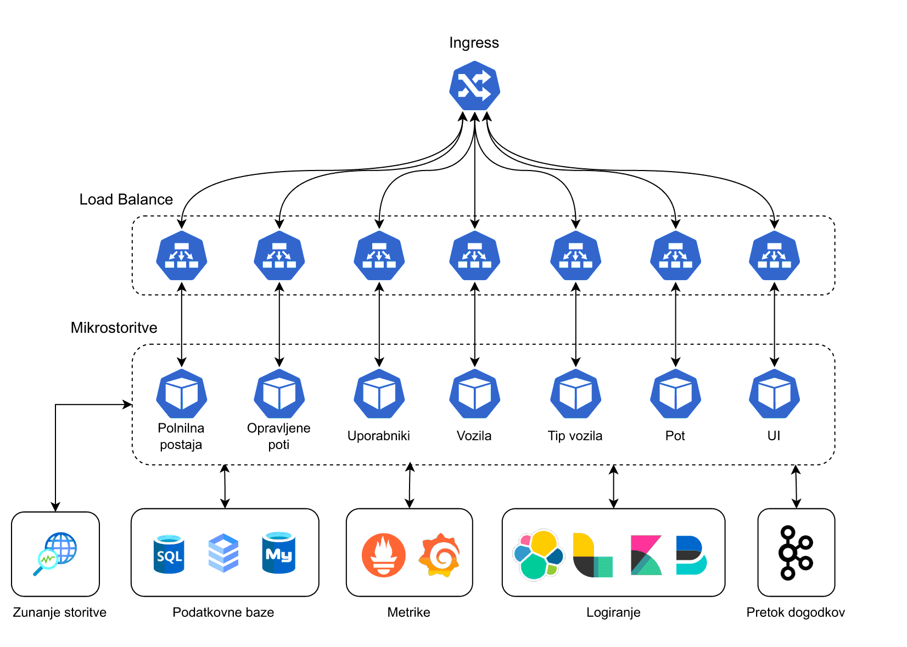

# Aplikacija za spremljanje (električnih) vozil

Cilj aplikacije je podpreti spremljanje električnih vozil v več pogledih. Od tega kako načrtovati pot avtomobila ter poiskati polnilno postajo v bližini, do planiranja postankov na podlagi načrtovane poti in predvideni hitrosti vožnje. Prav tako aplikacija omogoča iskanje po šifrantu vseh proizvedenih modelov (električnih) vozil, s katerim si lahko pomagamo pri nakupu novega vozila.

## Člani skupine

- Martin Dagarin
- Peter Timotej Avsec
- Tibor Čuš

## Mikrostoritve

Aplikacija je sestavljena iz sledečih mikrostoritev:

- [Opravljene poti](./microservice-opravljene-poti.md)
- [Polnilna postaja](./microservice-polnilna-postaja.md)
- [Pot](./microservice-pot.md)
- [Tip vozil](./microservice-tip-vozil.md)
- [Uporabniki](./microservice-uporabniki.md)
- [Vozila](./microservice-vozila.md)

Seznam končnih točk (endpointov), povezav do repozitorijev je navedena pri opisu posamezne mikrostoritve (klikni na povezavo).

## Kubernetis shema

## Povezave do ostalih storitev
- [Kibana](http://34.28.150.187:5601/app/home#/)
- [Consul](http://34.28.150.187:8500/)
- [Prometheus](http://35.224.249.132:9090/)

## Povezave do OpenApi vmesnikov

- [Opravljene poti](http://34.72.77.27:8080/swagger-ui/index.html)
- [Polnilna postaja](http://34.123.38.121:8080/swagger-ui/index.html)
- [Pot](http://34.160.27.153/path-service/swagger/index.html)
- [Tip vozil](http://34.173.72.45:8080/openapi)
- [Uporabniki](http://34.160.27.153/users-service/swagger/index.html)
- [Vozila](http://34.122.33.166:8081/openapi)
